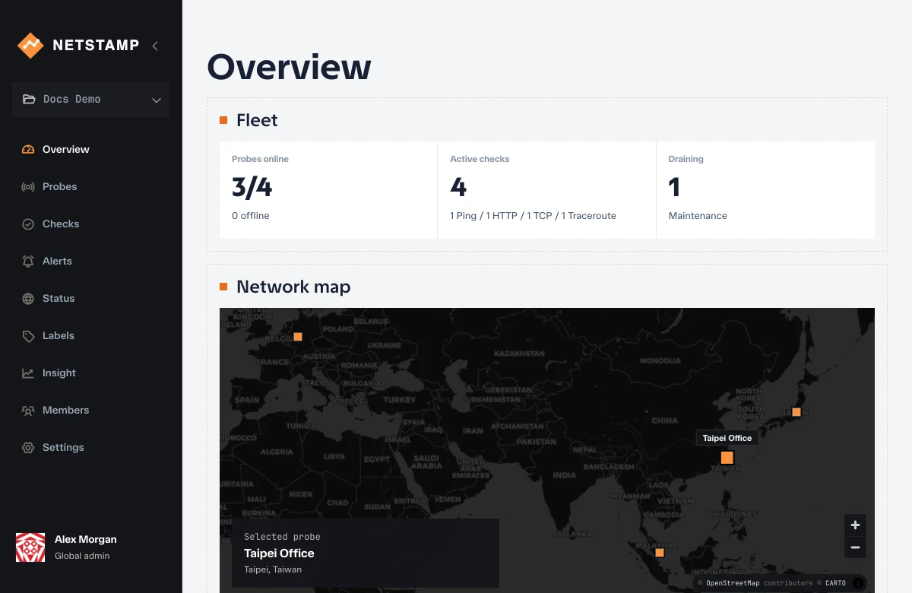
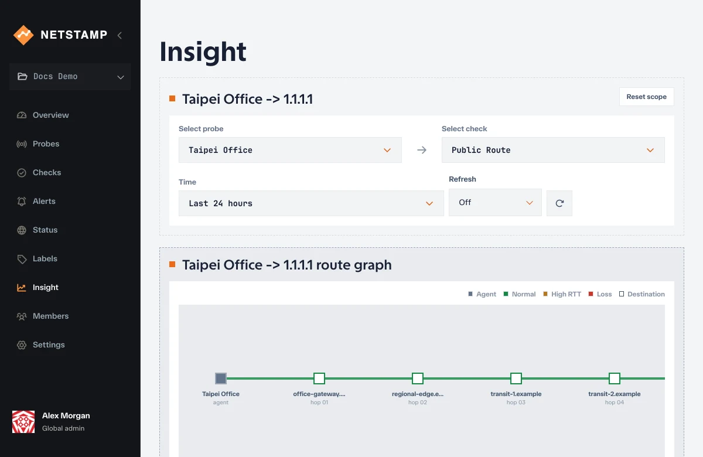
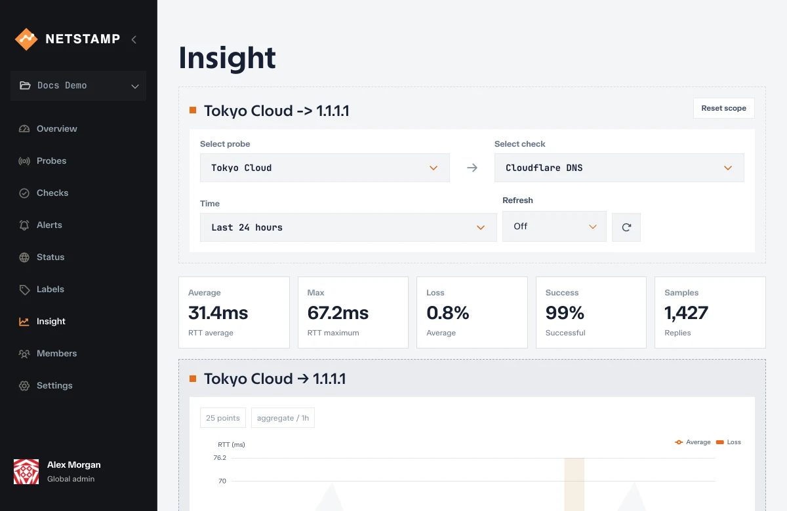
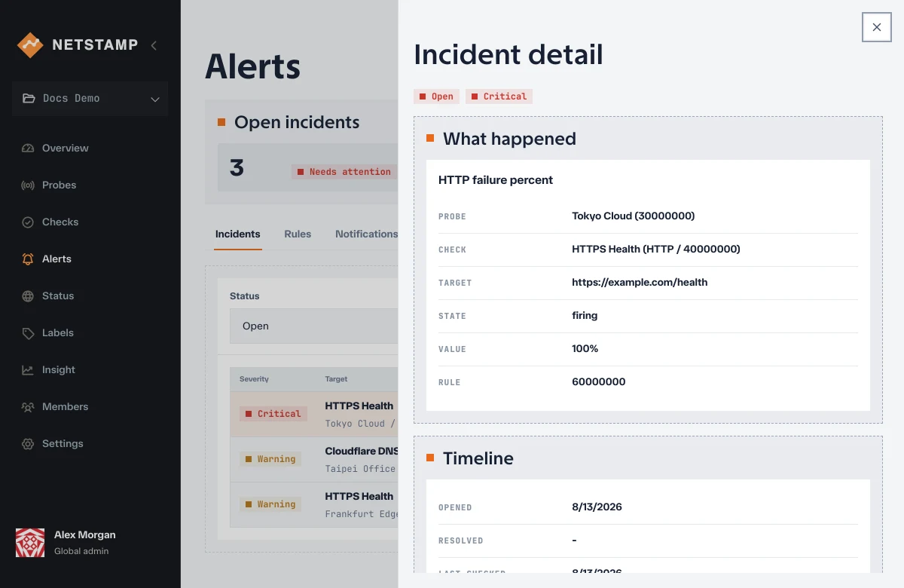
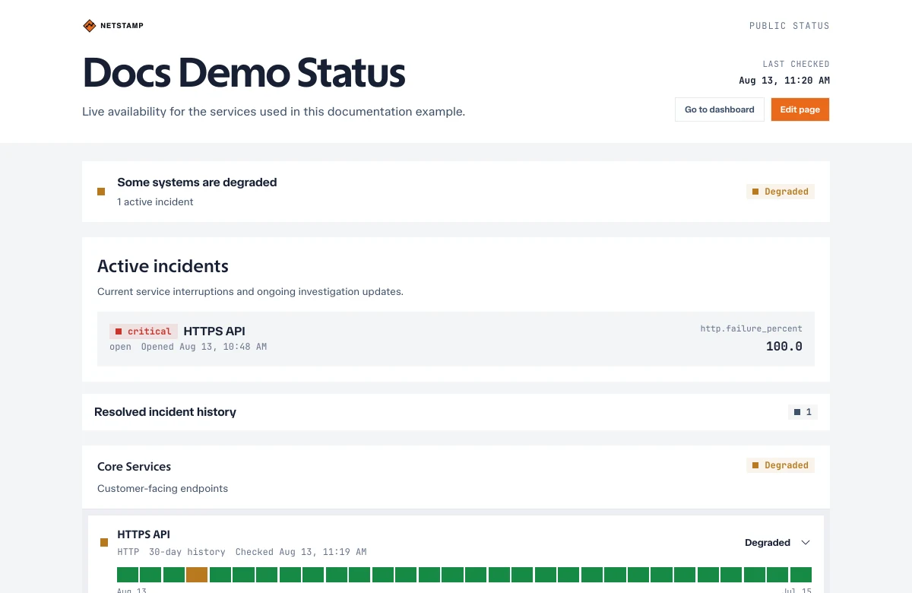

<div align="center">
  <picture>
    <source media="(prefers-color-scheme: dark)" srcset="./packages/brand/assets/netstamp-logo-light.svg" />
    
  </picture>

  <h3>Self-hosted network observability from probes you control.</h3>

  <p>
    See latency, packet loss, routes, TCP reachability, and probe health from the networks that matter to you.
  </p>

  <p>
    <a href="https://github.com/yorukot/netstamp/releases"></a>
    <a href="https://github.com/yorukot/netstamp/actions/workflows/backend.yaml"></a>
    <a href="https://github.com/yorukot/netstamp/actions/workflows/frontend.yaml"></a>
    <a href="https://hub.docker.com/r/yorukot/netstamp"></a>
    <a href="./LICENSE"></a>
  </p>

  <p>
    <a href="https://netstamp.dev"><b>Documentation</b></a>
    &nbsp;·&nbsp;
    <a href="https://demo.netstamp.dev"><b>Live demo</b></a>
    &nbsp;·&nbsp;
    <a href="https://netstamp.dev/docs/getting-started/quick-start/"><b>Quick start</b></a>
    &nbsp;·&nbsp;
    <a href="./CHANGELOG.md"><b>Changelog</b></a>
  </p>
</div>

---



<table>
  <tr>
    <td width="50%" align="center"><b>Traceroute paths</b></td>
    <td width="50%" align="center"><b>Ping latency</b></td>
  </tr>
  <tr>
    <td></td>
    <td></td>
  </tr>
  <tr>
    <td align="center"><b>Incidents</b></td>
    <td align="center"><b>Public status pages</b></td>
  </tr>
  <tr>
    <td></td>
    <td></td>
  </tr>
</table>

Netstamp is an open-source, self-hosted network observability app for people who need to understand what the internet looks like from their own machines, regions, labs, edge nodes, private infrastructure, and real user-facing networks.

Most monitoring platforms tell you whether a service is up from somebody else's cloud. Netstamp lets you place probes where your users, servers, and networks actually are, then observe reachability, latency, packet loss, routes, uptime, certificates, probe health, and incidents from those real viewpoints.

## Features

- **Probes you control.** Lightweight Linux agents (amd64 and arm64) install as a systemd service from a generated command and report to your own controller.
- **Real network checks.** Ping, TCP connect, HTTP/HTTPS assertions, Traceroute, and TLS certificate inspection from every assigned probe.
- **Insight views.** Compare latency, packet loss, HTTP timing phases, route graphs, hop latency, and certificate inventory by probe, target, and time range.
- **Alerts and incidents.** Threshold rules on Ping, TCP, HTTP/HTTPS, and TLS metrics turn breaches into tracked incidents with a timeline.
- **Notifications.** Webhook, Discord, Telegram, Slack, and Email destinations attached to alert rules.
- **Public status pages.** Publish component health, active incidents, and availability history without exposing the console.
- **Teams and access.** Projects, invitations, roles, scoped permissions, labels, probe selectors, and personal API tokens.
- **Built for operators.** PostgreSQL and TimescaleDB storage, an OpenAPI contract, health and metrics endpoints, and root administration tools.

## Live demo

Try Netstamp without installing anything at [demo.netstamp.dev](https://demo.netstamp.dev). The sign-in page shows the demo account credentials. The demo is read-only, so you can explore every view but not change anything.

## Quick Start

Run Netstamp with Docker Compose:

```bash
mkdir netstamp
cd netstamp
curl -fsSLO https://github.com/yorukot/netstamp/releases/latest/download/compose.yaml
curl -fsSLO https://github.com/yorukot/netstamp/releases/latest/download/env.example
cp env.example .env
chmod 600 .env
# Fill the required group at the top of .env with independent `openssl rand -hex 32` values.
docker compose up -d
```

Open Netstamp:

```text
http://localhost:3000
```

The first account you register becomes the system administrator. Then open **Probes**, select **New probe**, and run the generated install command on a Linux host to bring your first probe online. The [quick start guide](https://netstamp.dev/docs/getting-started/quick-start/) walks through the first project, probe, check, and result.

## Documentation

- [Quick start](https://netstamp.dev/docs/getting-started/quick-start/) deploys Netstamp and walks through the first project, probe, check, and result.
- [Installation](https://netstamp.dev/docs/installation/) covers Docker Compose, configuration, backups, authentication, and HTTPS.
- [Guides](https://netstamp.dev/docs/guides/) covers projects, probes, checks, Insight, alerts, notifications, status pages, accounts, and administration.
- [Operations](https://netstamp.dev/docs/operations/) covers the probe agent, observability, backups, and security hardening.
- [OpenAPI explorer](https://netstamp.dev/openapi/) documents API contracts and request models.
- [Changelog](./CHANGELOG.md) records notable updates, optimizations, documentation changes, and release milestones.

## Contributing

Contributions are welcome. [`CONTRIBUTING.md`](./CONTRIBUTING.md) covers the development setup, branch naming, validation commands, and pull request expectations. Documentation and interface translations are managed through Crowdin, so please do not edit non-English locale files directly.

## Support and security

- Report reproducible bugs and request features through [GitHub Issues](https://github.com/yorukot/netstamp/issues).
- Follow [`SECURITY.md`](./SECURITY.md) to report suspected vulnerabilities privately.
- Use the generated [OpenAPI explorer](https://netstamp.dev/openapi/) for API contracts and request models.

## License

Netstamp is licensed under the [Apache License 2.0](./LICENSE).

### Contributors

**Thanks to all the contributors for making this project even greater!**

<a href="https://github.com/yorukot/netstamp/graphs/contributors">
  
</a>

### Star History

**THANKS FOR All OF YOUR STARS!** Your stars are my motivation to keep updating!

<a href="https://star-history.com/#yorukot/netstamp&Timeline">
 <picture>
   <source media="(prefers-color-scheme: dark)" srcset="https://api.star-history.com/svg?repos=yorukot/netstamp&type=Timeline&theme=dark&sealed_token=nEoMOYsfp1zwZ7rT-Fm6VR2yTa6cwW35VR0BwVxTuE8Dt17vRcRIQUFXeWdh6lZixlAl5e_fIVFs2Xe4cRdvAnexR5Q6JqlGVZK05Iu0mko8gYLjTdjq0g" />
   <source media="(prefers-color-scheme: light)" srcset="https://api.star-history.com/svg?repos=yorukot/netstamp&type=Timeline&sealed_token=nEoMOYsfp1zwZ7rT-Fm6VR2yTa6cwW35VR0BwVxTuE8Dt17vRcRIQUFXeWdh6lZixlAl5e_fIVFs2Xe4cRdvAnexR5Q6JqlGVZK05Iu0mko8gYLjTdjq0g" />
   
 </picture>
</a>

<div align="center">

## ༼ つ ◕_◕ ༽つ Please share.

</div>
